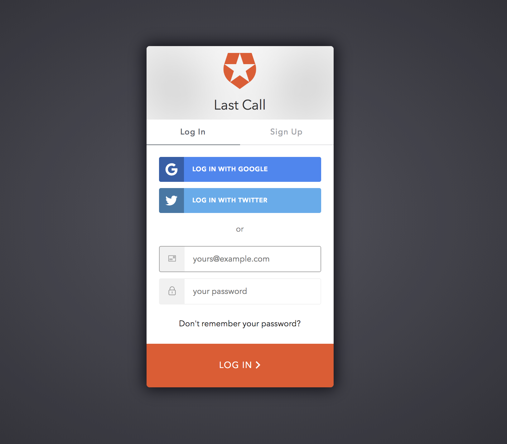
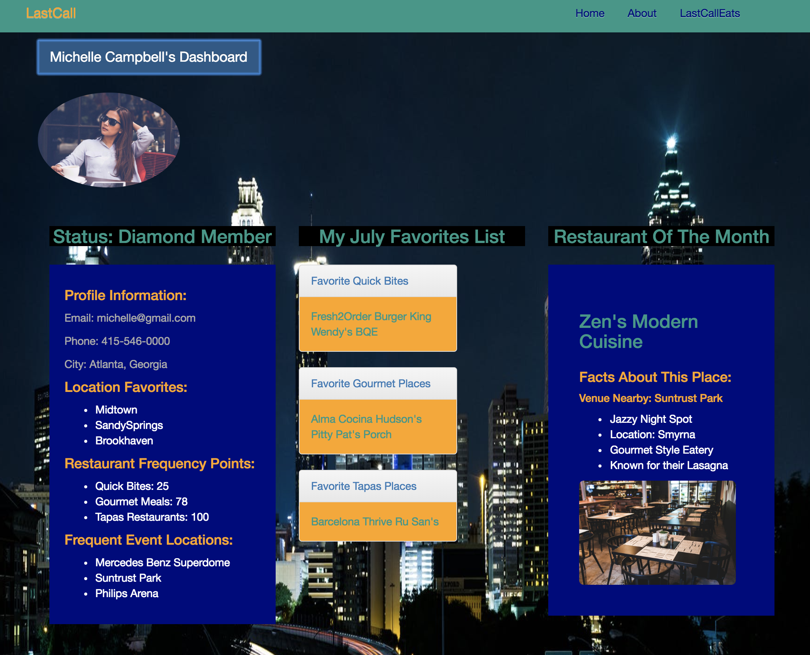
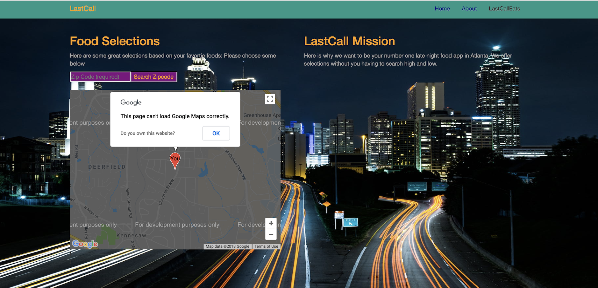

# Overview
## LastCall Restaurant App

LastCall is an application that gives users suggestions for restaurants open late after a sporting event, concert, or a late evening at a bar or club. Users can create a profile based on their preferences and restaurants they frequently visit. 

# Application Use
Users can click on the login button from the home page to access their account. Once a user is logged in, they can click on Account Information or Find Food Near Me. In the Account Information page, the user can set their favorite restaurants, send feedback or ask questions and set their favorite locations.In the Find Food Near Me section, the user can enter their zip code to find restaurants close to the event they are attending in which map will provide them with location details.

### User Authentication Feature
* Auth0

After the user is authenticated, they will have access to their account. Here they can choose the preferences of their favorite event venues and their favorite restaurants.

## Group Members
Jennifer Ponder
Sarah Shelden
Joe Kim

## Tech Stack Used

React 
React-Bootstrap
JavaScript ES6
Node.js
Express.js
HTML5/CSS
Materialize
MongoDB
Docker

# Development Process
1. Concept

2. Initial Planning

3. Challenges and Successes

4. Future Additions

## 1. Concept
The concept came about after brainstorming on the idea of what would be very useful in a restaurant app. Also how the restaurant app would be different and what problem would this app solve. So we came up with LastCall to address solving the problem of finding restaurants open late without having to travel too far out of your comfort zone. While brainstorming the type of users who would use this app, we thought about the countless number of times we knew someone who always wanted to find food after late events and even finding ourselves in that situation. We thought it would be a great idea to have an application that could locate restaurants within a 3 to 5 mile radius which would offer close possibilities without a person traveling too far out of their way which can be frustrating and waste time.

## 2. Initial Planning

A major challenge was gettubg the map to display on the DOM correctly and getting the markers to set the locations within the correct logitute and lattitude.

Another challenge was certain UI element movements in react-bootstrap. There were some workarounds and features that were addressed to make certain features in pages show in the intended format.

Since a major objective of our project was to familiarize ourselves with new concepts to make this project work in a short amount of time, our application does not fully account for the implementation of future features.

Both issues were fixed by inspecting our home html page elements in the developer tools, and checking to see what other elements could be overwritten and taking out an external css file that was initially written to handle other styling. As materialize works with inline styling. Also, routes were refactored to grab the correct pages once the user sends a request or wants to post data on a specific route.

## 3. Future Additions

If we had more time, we would...

Add a full demo for a user to create a user profile in seconds
Allow users to interact with more comment features
Test additional UI features that may address some element movement challenges
Create more features to add parking locations to the application
Add more users to the database
Adjust the longitude and lattitude in Google Places to pick up on locations in other states

